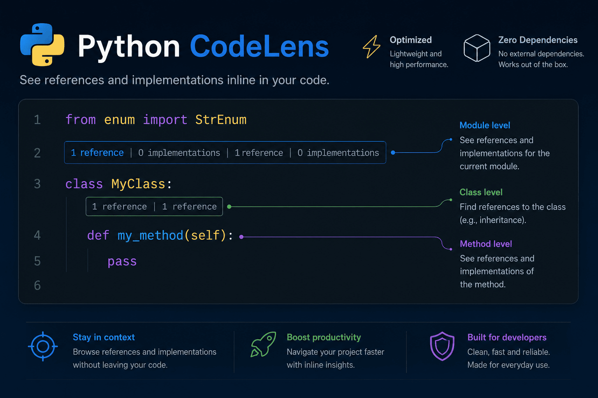

# Python CodeLens Lite

**Lightweight, configurable CodeLens for Python** — shows references, implementations, and scoped imports directly above each symbol.

> Powered entirely by VS Code's native `DocumentSymbolProvider` and `ReferenceProvider` (Pylance / Pyright). No extra runtime dependencies.



---

## Features

- **Reference counts** above classes, methods, functions, variables, and imports.
- **Implementation counts** for classes (how many subclasses inherit from them).
- **Scoped import lenses** with fine-grained classification: project, venv, stdlib, or global.
- **Smart filtering** — exclude import statements, the definition itself, or self-references from the count.
- **Click action** — open an inline peek view or jump to a matching reference.
- **Per-resource configuration** — different settings per workspace folder or file.
- **Performance guards** — configurable debounce delay and file-size limit.
- **Localized UI** — settings descriptions and command titles are shown in **English** or **Brazilian Portuguese** automatically based on your VS Code display language.

---

## Requirements

- VS Code `1.96.0` or later.
- A Python language server that provides references (e.g. **Pylance** or **Pyright**).  
  Without one, all counts will show `0 references`.

---

## Installation

**From the Marketplace:**  
Search for `Python CodeLens Lite` in the VS Code Extensions view.

**From a `.vsix` file:**
```bash
npm run package   # generates python-codelens-lite-x.x.x.vsix
```
Then: **Extensions → ··· → Install from VSIX…**

---

## Commands

| Command | Description |
|---|---|
| `Python CodeLens Lite: Toggle CodeLens` | Enable / disable the extension globally. |
| `Python CodeLens Lite: Refresh Lenses` | Force-refresh all CodeLenses in the active editor. |

Access via the Command Palette (`Ctrl+Shift+P` / `⌘⇧P`).

---

## Settings

All settings support `resource` scope (per-folder or per-file overrides via `.vscode/settings.json`).

### General

| Setting | Default | Description |
|---|---|---|
| `pythonCodeLensLite.enable` | `true` | Enable or disable the extension. |
| `pythonCodeLensLite.files.includeInitPy` | `true` | Include `__init__.py` files when showing CodeLens and counting references. |
| `pythonCodeLensLite.clickAction` | `"peek"` | `"peek"` opens an inline peek view; `"reveal"` jumps to a matching reference in the editor. |

### Targets — which symbols get a lens

| Setting | Default | Description |
|---|---|---|
| `pythonCodeLensLite.targets.classes` | `true` | CodeLens for `class` definitions. |
| `pythonCodeLensLite.targets.methods` | `true` | CodeLens for methods (functions inside classes). |
| `pythonCodeLensLite.targets.functions` | `true` | CodeLens for top-level functions. |
| `pythonCodeLensLite.targets.moduleVariables` | `false` | CodeLens for module-level variables / constants. |
| `pythonCodeLensLite.targets.imports.project` | `false` | CodeLens for imports from within the workspace. |
| `pythonCodeLensLite.targets.imports.venv` | `false` | CodeLens for imports from virtual environments. |
| `pythonCodeLensLite.targets.imports.stdlib` | `false` | CodeLens for standard library imports. |
| `pythonCodeLensLite.targets.imports.global` | `false` | CodeLens for imports that cannot be classified. |

### References — filtering

| Setting | Default | Description |
|---|---|---|
| `pythonCodeLensLite.references.filterImports` | `true` | Exclude occurrences inside `import`/`from` statements. |
| `pythonCodeLensLite.references.filterDefinitions` | `true` | Exclude the definition's own location from the count. |
| `pythonCodeLensLite.references.filterSelf` | `false` | Exclude references inside the symbol's own scope. |
| `pythonCodeLensLite.references.minCount` | `0` | Hide lens when filtered count is below this value. |
| `pythonCodeLensLite.references.showZero` | `true` | Hide lenses with exactly zero references when `false`. |

### Lenses

| Setting | Default | Description |
|---|---|---|
| `pythonCodeLensLite.lenses.showImplementations` | `true` | Show a second lens with the subclass count for classes. |

### Performance

| Setting | Default | Description |
|---|---|---|
| `pythonCodeLensLite.performance.debounceMs` | `250` | Milliseconds to wait after typing before refreshing. |
| `pythonCodeLensLite.performance.maxFileSizeKB` | `512` | Skip files larger than this size (in KB). Use `0` to disable this guard. |

### Exclusions

| Setting | Default | Description |
|---|---|---|
| `pythonCodeLensLite.exclude` | `["**/.venv/**", ...]` | Glob patterns for files that should be skipped entirely. |

---

## Localization

The extension automatically adapts to your VS Code display language:

- **English** (`en`) — default.
- **Brazilian Portuguese** (`pt-br`) — settings descriptions and command titles are shown in Portuguese when VS Code is set to `pt-BR`.

To change your VS Code display language: `Configure Display Language` in the Command Palette.

---

## Tips

**Hide lenses on rarely-referenced symbols**
```jsonc
// .vscode/settings.json
"pythonCodeLensLite.references.showZero": false,
"pythonCodeLensLite.references.minCount": 2
```

**See which parts of your project import a given module**
```jsonc
"pythonCodeLensLite.targets.imports.project": true,
"pythonCodeLensLite.references.filterImports": false
```

**Reduce CPU usage on large codebases**
```jsonc
"pythonCodeLensLite.performance.debounceMs": 500,
"pythonCodeLensLite.performance.maxFileSizeKB": 256
```

**Ignore package initializer files**
```jsonc
"pythonCodeLensLite.files.includeInitPy": false
```

**Exclude generated or vendored files**
```jsonc
"pythonCodeLensLite.exclude": [
  "**/.venv/**",
  "**/venv/**",
  "**/site-packages/**",
  "**/__pycache__/**",
  "**/migrations/**",
  "**/vendor/**"
]
```

---

## How It Works

1. On activation, a `CodeLensProvider` is registered for all Python (`file` scheme) documents.
2. `provideCodeLenses` uses VS Code's `DocumentSymbolProvider` to list eligible symbols, then emits placeholder lenses.
3. `resolveCodeLens` calls `vscode.executeReferenceProvider` for each symbol, applies the configured filters, and sets the final label and click command.
4. Configuration is cached per URI and invalidated whenever settings change or workspace folders are added/removed.
5. Document edits are debounced to avoid redundant work while typing.

---

## Contributing

Issues and pull requests are welcome. The project has no runtime dependencies — keep it that way.

```bash
npm install       # install dev dependencies
npm run check     # type-check without emitting files
npm run compile   # bundle dist/extension.js
npm run watch     # compile + watch
# Press F5 in VS Code to launch an Extension Development Host
```

---

## Bugs reports & Features requests

You can submit a bug report or a feature suggestion via [GitHub Issue Tracker](https://github.com/rafaelpeter03/python-codelens-lite/issues).

---

## License

[MIT](LICENSE)
